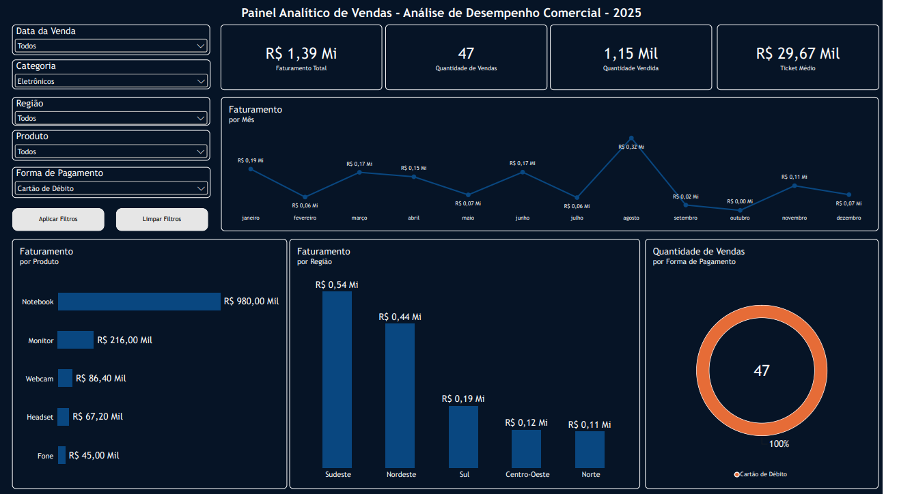
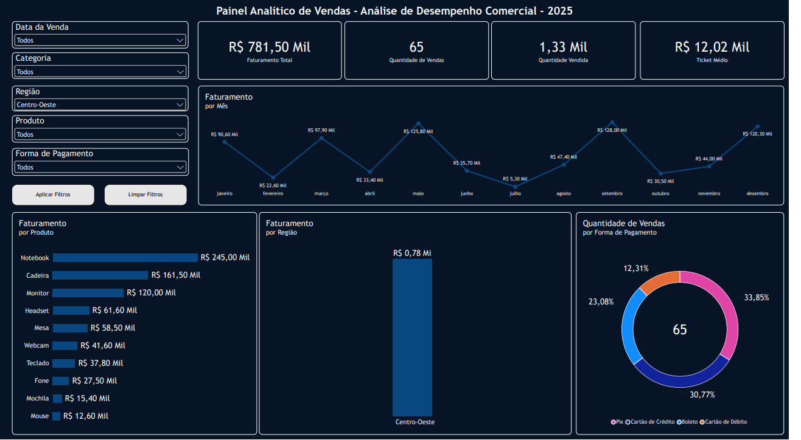
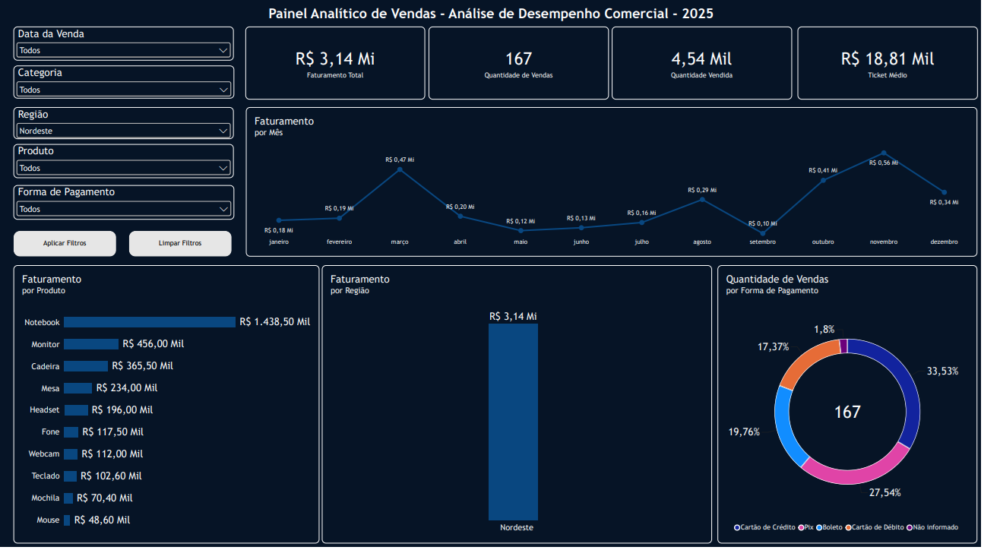
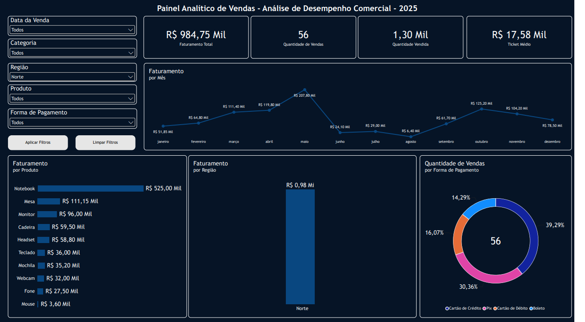
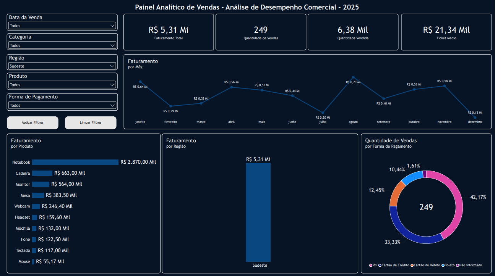
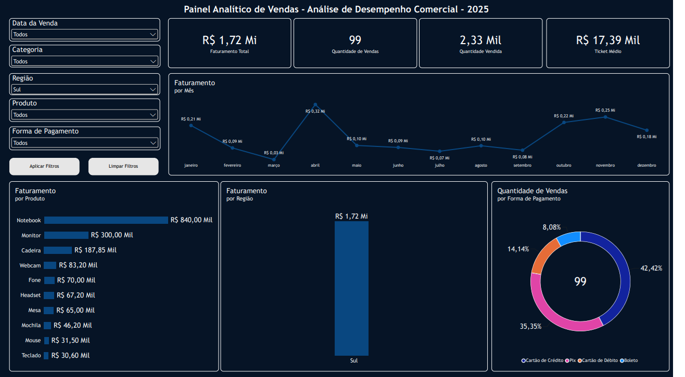

# Painel Analítico de Vendas — Desempenho Comercial 2025

Projeto de análise de dados e Business Intelligence desenvolvido com **Python, Pandas, Jupyter Notebook, DAX e Power BI**, com foco na preparação de dados de vendas e na construção de um painel interativo para acompanhar o desempenho comercial ao longo de 2025.

## Objetivo

Transformar uma base de vendas em informações visuais que facilitem a análise de faturamento, volume de vendas, produtos, regiões e formas de pagamento.

## O que foi desenvolvido

- **Preparação dos dados:** análise e tratamento da base de vendas utilizando Python e Pandas, com registro do processo em notebook.
- **Base tratada:** exportação dos dados preparados para utilização na análise.
- **Dashboard no Power BI:** criação de um painel com indicadores e gráficos interativos.
- **Filtros:** segmentação por data da venda, categoria, região, produto e forma de pagamento.
- **Indicadores principais:** faturamento total, quantidade de vendas, quantidade vendida e ticket médio.
- **Análises visuais:** faturamento mensal, faturamento por produto, faturamento por região e quantidade de vendas por forma de pagamento.
- **Análise regional:** exploração do painel para diferentes regiões do Brasil, incluindo a categoria “Não informado” quando aplicável.

## Tecnologias e ferramentas

- Python
- Pandas
- DAX
- Jupyter Notebook
- Power BI
- CSV

## Estrutura do projeto

```text
projeto-dashboard-vendas/
├── README.md
├── tratamento.ipynb
├── analise_vendas.pbix
├── base_vendas.csv
├── vendas_limpa.csv
└── imagens/
    ├── visao_geral.png
    ├── regiao_centro_oeste.png
    ├── regiao_nordeste.png
    ├── regiao_norte.png
    ├── regiao_sudeste.png
    └── regiao_sul.png
    └── regiao_nao_informada.png
```

## Visualizações do dashboard

### Visão geral



### Análises por região

**Centro-Oeste**



**Nordeste**



**Norte**



**Sudeste**



**Sul**



**Região não informada**


## Como visualizar

### Dashboard no Power BI

1. Baixe o arquivo `analise_powerbi.pbix`.
2. Abra-o no **Power BI Desktop**.
3. Utilize os filtros à esquerda para explorar os dados.
4. Se o Power BI solicitar atualização ou localização da fonte de dados, ajuste a origem para o arquivo CSV correspondente, conforme a configuração usada no projeto.

### Notebook de tratamento

1. Baixe `tratamento.ipynb` e os arquivos CSV.
2. Abra o notebook no Jupyter Notebook, JupyterLab ou VS Code com suporte a notebooks.
3. Confira as células na ordem e ajuste os caminhos dos arquivos, se necessário.
4. Execute as células para acompanhar o processo de preparação dos dados.

## Observações

- Os arquivos CSV representam a base original e a base após o tratamento, conforme disponibilizados neste repositório.
- Os valores e indicadores exibidos no painel correspondem à base utilizada no projeto.
- As imagens são capturas de tela de diferentes filtros e perspectivas do dashboard.
- Este repositório documenta um projeto de portfólio para demonstrar etapas de preparação, análise e visualização de dados.

## Autor

**Carlos Augusto Soares**  
Projeto de portfólio — Análise de Dados e Business Intelligence
